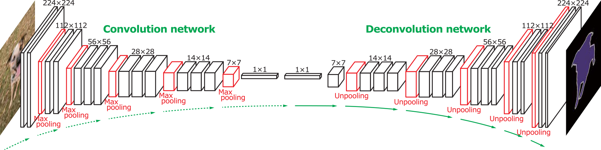

### Semantic Segmentation Project
The project involves the use of a fully convolutional neural network (FCN) to classify the pixels in an image. The deep learning model uses a pre-trained VGG-16 model as a foundation (see paper by Jonathan Long). In this implementation of FCN, we reuse pre-trained layers 3, 4 and 7 of the VGG model and then generate 1x1 convolutions of these layers. This phase is like an encoder that extracts features.  The encoding is then followed by a decoding process using a series of upsampling layers. Upsampling is performed using transposed convolution or more accurately called fractionally strided convolution. This is an operation that goes in the opposite direction to a convolution and allows us to translate the activations into something meaningful related to the image size by scaling scaling up the activation size to the same image size. The encoding and decoding process is ilustrated below

Image Credit: http://cvlab.postech.ac.kr/research/deconvnet/

In the process, we lose some resolution because the activations were downscaled and therefore to add back some resolution by adding activations from the previous layer called as skip connections.

#### Training and optimisation
The network was trained on a g3x2XLarge AWS instance on the [Kitti Road data set](http://www.cvlibs.net/datasets/kitti/eval_road.php)
using the following hyper parameters:
'lr':              0.0001,
'keep_prob':       0.25,
'epochs':          25,
'batch_size':      16,
'std_init':        0.01,
'num_classes':     2,
'image_shape':     (160, 576)

Optimisation was done using cross entropy loss minimisation as the metric and ADAM optimiser. The cross entropy loss is computed against the correct ground truth image (also flattened)

#### Retrospective
The results were good for the most partas can be seen in the following output samples.

It even seems to distinguish road and cossing rail tracks( see the third row third column). It does have some failings particularly small patches around cars. The model could benefit from data augmentation but have left with for a future run along with also trying the model on citiscapes data. 